# Brain Tumor Multimodal XAI

An end-to-end clinical decision support system for brain tumor analysis that combines:

- MRI diagnosis with detection, segmentation, and classification
- multimodal prognosis from MRI, WSI, RNA-seq, and clinical data
- explainable AI for both visual and genomic evidence
- a production-style web platform for asynchronous AI inference and reporting

This repository is built from the student research project:

_Development of a Multimodal Deep Learning Model with XAI for Brain Tumor Diagnosis and Prognosis_

## Highlights

- MRI pipeline with **YOLOv11 + DynUNet + DenseNet169**
- Multimodal prognosis with **gated attention fusion + CoxPH risk modeling**
- XAI stack with **ODAM**, **Seg-Eigen-CAM**, **Finer-CAM**, and **Grad-CAM family**
- Web CDSS architecture using **Next.js**, **FastAPI**, **Celery**, **Redis**, **PostgreSQL**, and object storage
- Quantitative evaluation summarized from the full thesis report

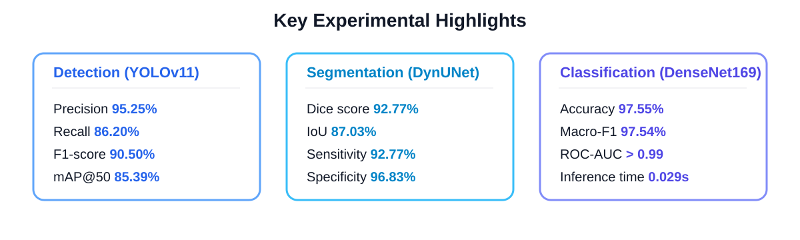

## Project Scope

The system is organized around three core modules described in the project report:

1. **MRI diagnosis module**
   - tumor detection
   - tumor segmentation
   - tumor classification
   - per-stage explainability

2. **Multimodal prognosis module**
   - MRI, WSI, RNA-seq, and clinical feature fusion
   - Cox proportional hazards risk estimation
   - visual and genomic explainability

3. **Clinical web platform**
   - patient management
   - asynchronous inference orchestration
   - result review, XAI visualization, and reporting

## System Architecture

### 3-layer MRI analysis and XAI architecture

This figure is adapted from the full report and shows the application layer, AI inference layer, and XAI/storage layer used by the MRI workflow.

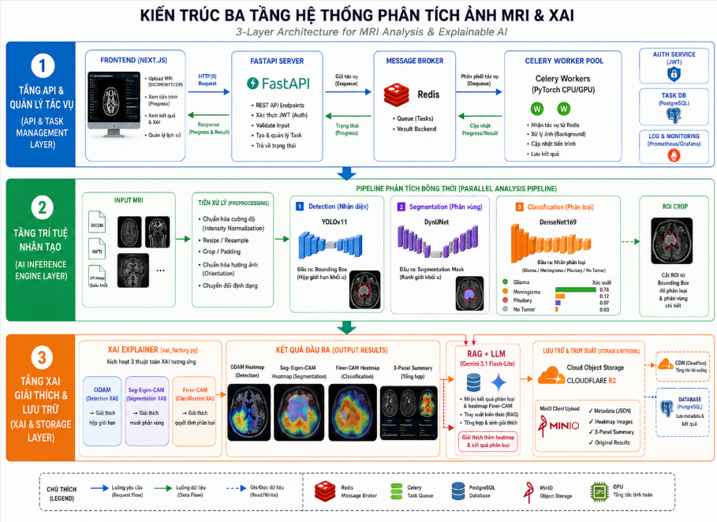

### MRI workflow with XAI, RAG, and report generation

The MRI branch starts from raw input, runs detection, segmentation, and classification, then stores XAI artifacts and supports language-based explanation.

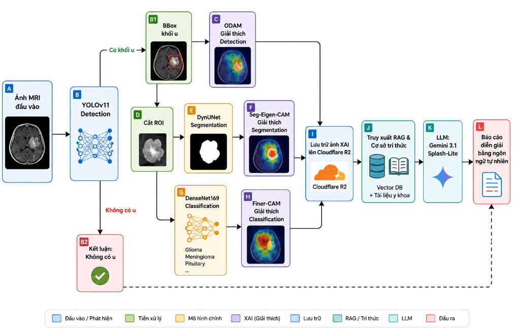

### Multimodal prognosis architecture

The prognosis branch fuses MRI, WSI, RNA, and clinical embeddings using attention-based feature fusion before CoxPH risk prediction.

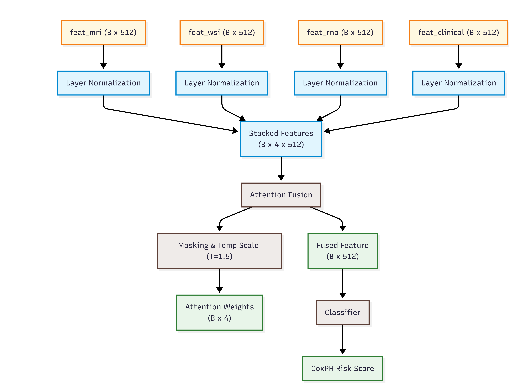

## Clinical Chatbox Agent

The web platform also includes a floating clinical chatbox Agent designed to help doctors interact with the system in a more natural workflow.

### What the Agent does

- answers patient-centric questions from the current web context
- summarizes diagnosis history and AI outputs
- explains MRI/XAI results in natural language
- supports quick MRI diagnosis directly from the chatbox
- guides the user to review-related actions when classification results need expert confirmation
- streams responses token by token for a live conversational experience

### Agent architecture in the web system

The chatbox is implemented as a context-aware application layer on top of the main backend:

1. **Frontend widget**
   - floating chat entry available across pages
   - sends `message`, `current_page`, `patient_id`, and `image_id`
   - supports file attachment for quick MRI diagnosis

2. **Planner and validation layer**
   - classifies user intent
   - decides whether the query needs patient context, image context, notifications, or quick MRI execution
   - validates whether required identifiers are present before tool execution

3. **Tool execution layer**
   - loads patient profile
   - loads diagnosis history
   - loads image analysis and XAI metadata
   - loads system notifications
   - uploads MRI and starts the MRI pipeline through the chat workflow

4. **LLM response layer**
   - uses Gemini as the response model
   - formats the final answer in clinician-friendly text
   - avoids inventing patient data by grounding responses on tool outputs

### Current chatbox capabilities

Based on the current implementation in `backend/agent` and the frontend widget, the Agent supports:

- **Context-aware patient QA**
  - understands which patient or result page the doctor is currently viewing
  - answers questions such as diagnosis label, confidence, risk group, and recent history

- **Streaming responses**
  - backend exposes a streaming endpoint for incremental generation
  - frontend renders the answer progressively instead of waiting for the full text

- **Conversation memory**
  - conversation threads are stored in the database
  - messages can be reloaded from chat history
  - conversations can be summarized and deleted from the UI

- **Quick MRI diagnosis through chatbox**
  - the doctor can attach an MRI file directly in chat
  - if no patient context is available, the Agent interrupts and asks the user to choose a patient
  - after patient selection, the Agent resumes the MRI pipeline automatically
  - once inference finishes, the Agent summarizes the result in chat and redirects to the result page

- **Review-aware assistance**
  - the Agent can surface review-related information for low-confidence classification cases
  - the workflow aligns with expert confirmation and relabeling in the web platform

### Backend entry points

The main Agent backend currently includes:

- `/agent/chat`
- `/agent/chat/stream`
- `/agent/conversations`
- `/agent/conversations/{thread_id}`
- `/agent/quick-mri`
- `/agent/quick-mri/{image_id}/summary`
- `/agent/notifications`

### Why this matters

The chatbox Agent is not just a generic assistant layered on top of the web UI. It acts as an orchestration interface for the existing clinical system:

- it reduces navigation friction for doctors
- it exposes AI outputs through natural-language interaction
- it bridges structured medical records, image analysis, XAI artifacts, and asynchronous inference tasks
- it provides a foundation for future RAG-Agent and human-in-the-loop workflows

## Explainable AI Design

The project uses different XAI mechanisms for different prediction tasks instead of forcing one heatmap method onto every branch.

### Detection XAI: ODAM

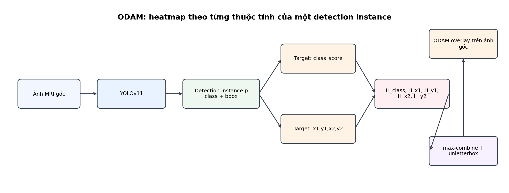

### Segmentation XAI: Seg-Eigen-CAM

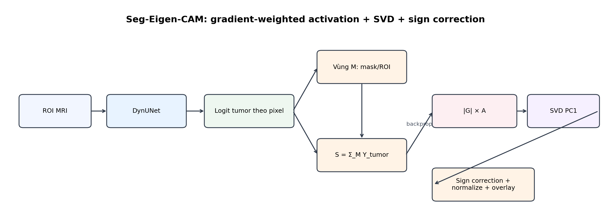

### Classification XAI: Finer-CAM


## Experimental Results

The following summary is derived from the full report and the packaged experiment outputs included in this repository.

### Technical objectives vs achieved results

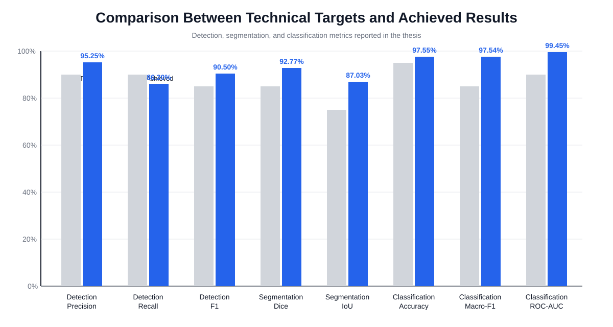

Key MRI diagnosis metrics reported in the thesis:

- **Detection**
  - Precision: **95.25%**
  - Recall: **86.20%**
  - F1-score: **90.50%**
  - mAP@50: **85.39%**

- **Segmentation**
  - Dice: **92.77%**
  - IoU: **87.03%**
  - Sensitivity: **92.77%**
  - Specificity: **96.83%**

- **Classification**
  - Accuracy: **97.55%**
  - Macro-F1: **97.54%**
  - ROC-AUC: **99.45%**
  - Inference time: **0.029 s**

### XAI quantitative summary

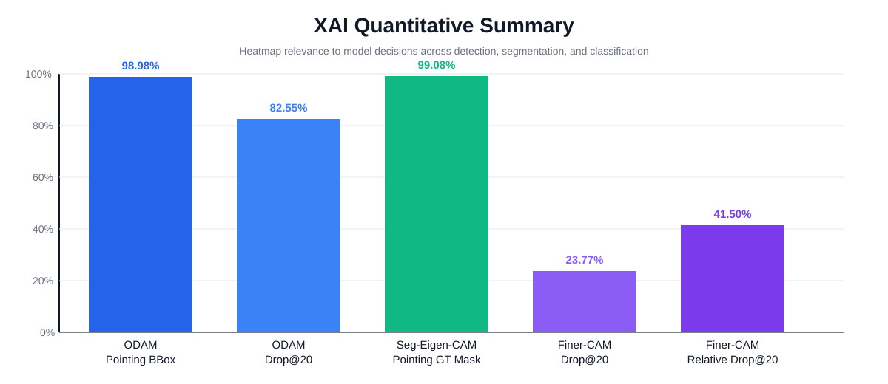

Representative XAI findings highlighted in the report:

- **ODAM** explains the detection branch well
  - Pointing game on bbox: **98.98%**
  - Confidence drop@20 when masking important region: **82.55%**

- **Seg-Eigen-CAM** explains the segmentation branch well
  - Pointing to GT mask: **99.08%**

- **Finer-CAM** captures class-discriminative evidence
  - Drop@20: **23.77%**
  - Relative drop@20: **41.50%**

### Example outputs

MRI detection result:

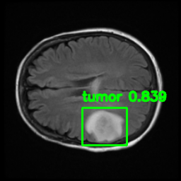

MRI segmentation result:

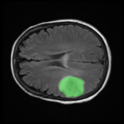

Classification XAI example:

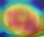

Multimodal prognosis XAI example:

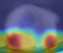

## Repository Structure

```text
.
├── backend/        FastAPI APIs, AI pipeline integration, async task orchestration
├── frontend/       Next.js clinical dashboard
├── assets/readme/  README figures and exported report diagrams
├── notebooks/      Research and experiment notebooks
├── scratch/        Intermediate experiment/report artifacts
├── test_output/    Sample generated MRI outputs
├── docker-compose.yml
├── docker-compose.tunnel.yml
└── README.md
```

## Technology Stack

### Application layer

- Next.js
- React
- TypeScript
- Tailwind CSS

### Backend and orchestration

- FastAPI
- Celery
- Redis
- PostgreSQL
- MinIO / object storage

### AI and XAI

- YOLOv11
- DynUNet
- DenseNet169
- CoxPH-based multimodal prognosis
- ODAM
- Seg-Eigen-CAM
- Finer-CAM
- Grad-CAM / Grad-CAM++ / LayerCAM

## Quick Start

### Frontend

```bash
cd frontend
npm install
npm run dev
```

Expected frontend environment:

```env
NEXT_PUBLIC_API_URL=http://localhost:8000
NEXT_PUBLIC_USE_MOCK_DATA=false
```

### Backend and infrastructure

```bash
docker compose up --build
```

This starts the main backend services used by the web platform and asynchronous AI workflow.

### API documentation

Once the backend is running:

```text
http://localhost:8000/docs
```

## Research Notes

The thesis report describes the project in six major parts:

- motivation and problem setting
- literature review
- theoretical background
- proposed architecture and system design
- experiments and evaluation
- conclusions and future directions

The README intentionally focuses on the implementation-facing summary, while the full report provides the detailed academic discussion, data protocol, and metric interpretation.

## Authors

- Pham Huynh Quoc Dat
- Nguyen Hai Dang
- Vuong Quoc An

Academic advisor:

- Dr. Trinh Hung Cuong

## Acknowledgment

The architecture figures and result summaries in this README are adapted from the attached thesis report and the experiment artifacts packaged with this repository.
